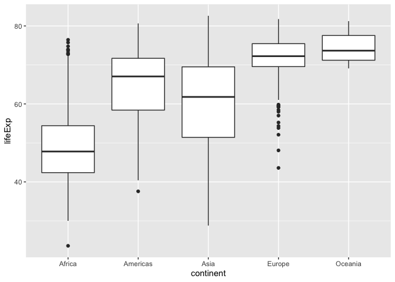

## Instructions
Answer the following questions and complete the exercises in RMarkdown. Please embed all of your code and push your final work to your repository. Your final lab report should be organized, clean, and run free from errors. Remember, you must remove the `#` for any included code chunks to run.  

## Libraries

```r
library(tidyverse)
```

## Resources
The idea for this assignment came from [Rebecca Barter's](http://www.rebeccabarter.com/blog/2017-11-17-ggplot2_tutorial/) ggplot tutorial so if you get stuck this is a good place to have a look.  

## Gapminder
For this assignment, we are going to use the dataset [gapminder](https://cran.r-project.org/web/packages/gapminder/index.html). Gapminder includes information about economics, population, and life expectancy from countries all over the world. You will need to install it before use. This is the same data that we used for the practice midterm. You may want to load that assignment for reference.  

```r
#install.packages("gapminder")
library("gapminder")
```

## Questions
The questions below are open-ended and have many possible solutions. Your approach should, where appropriate, include numerical summaries and visuals. Be creative; assume you are building an analysis that you would ultimately present to an audience of stakeholders. Feel free to try out different `geoms` if they more clearly present your results.  

**1. Use the function(s) of your choice to get an idea of the overall structure of the data frame, including its dimensions, column names, variable classes, etc. As part of this, determine how NAs are treated in the data.**  

```r
glimpse(gapminder)
```

```
## Observations: 1,704
## Variables: 6
## $ country   <fct> Afghanistan, Afghanistan, Afghanistan, Afghanistan, Afghani<U+2026>
## $ continent <fct> Asia, Asia, Asia, Asia, Asia, Asia, Asia, Asia, Asia, Asia,<U+2026>
## $ year      <int> 1952, 1957, 1962, 1967, 1972, 1977, 1982, 1987, 1992, 1997,<U+2026>
## $ lifeExp   <dbl> 28.801, 30.332, 31.997, 34.020, 36.088, 38.438, 39.854, 40.<U+2026>
## $ pop       <int> 8425333, 9240934, 10267083, 11537966, 13079460, 14880372, 1<U+2026>
## $ gdpPercap <dbl> 779.4453, 820.8530, 853.1007, 836.1971, 739.9811, 786.1134,<U+2026>
```


```r
str(gapminder)
```

```
## Classes 'tbl_df', 'tbl' and 'data.frame':	1704 obs. of  6 variables:
##  $ country  : Factor w/ 142 levels "Afghanistan",..: 1 1 1 1 1 1 1 1 1 1 ...
##  $ continent: Factor w/ 5 levels "Africa","Americas",..: 3 3 3 3 3 3 3 3 3 3 ...
##  $ year     : int  1952 1957 1962 1967 1972 1977 1982 1987 1992 1997 ...
##  $ lifeExp  : num  28.8 30.3 32 34 36.1 ...
##  $ pop      : int  8425333 9240934 10267083 11537966 13079460 14880372 12881816 13867957 16317921 22227415 ...
##  $ gdpPercap: num  779 821 853 836 740 ...
```


```r
gapminder %>% 
  anyNA()
```

```
## [1] FALSE
```


```r
summary(gapminder)
```

```
##         country        continent        year         lifeExp     
##  Afghanistan:  12   Africa  :624   Min.   :1952   Min.   :23.60  
##  Albania    :  12   Americas:300   1st Qu.:1966   1st Qu.:48.20  
##  Algeria    :  12   Asia    :396   Median :1980   Median :60.71  
##  Angola     :  12   Europe  :360   Mean   :1980   Mean   :59.47  
##  Argentina  :  12   Oceania : 24   3rd Qu.:1993   3rd Qu.:70.85  
##  Australia  :  12                  Max.   :2007   Max.   :82.60  
##  (Other)    :1632                                                
##       pop              gdpPercap       
##  Min.   :6.001e+04   Min.   :   241.2  
##  1st Qu.:2.794e+06   1st Qu.:  1202.1  
##  Median :7.024e+06   Median :  3531.8  
##  Mean   :2.960e+07   Mean   :  7215.3  
##  3rd Qu.:1.959e+07   3rd Qu.:  9325.5  
##  Max.   :1.319e+09   Max.   :113523.1  
## 
```

**2. Among the interesting variables in gapminder is life expectancy. How has global life expectancy changed between 1952 and 2007?**

```r
gapminder %>% 
  group_by(year) %>% 
  summarize(min_lifeExp=min(lifeExp),
            max_lifeExp=max(lifeExp),
            mean_lifeExp=mean(lifeExp),
            median_lifeExp=median(lifeExp))
```

```
## # A tibble: 12 x 5
##     year min_lifeExp max_lifeExp mean_lifeExp median_lifeExp
##    <int>       <dbl>       <dbl>        <dbl>          <dbl>
##  1  1952        28.8        72.7         49.1           45.1
##  2  1957        30.3        73.5         51.5           48.4
##  3  1962        32.0        73.7         53.6           50.9
##  4  1967        34.0        74.2         55.7           53.8
##  5  1972        35.4        74.7         57.6           56.5
##  6  1977        31.2        76.1         59.6           59.7
##  7  1982        38.4        77.1         61.5           62.4
##  8  1987        39.9        78.7         63.2           65.8
##  9  1992        23.6        79.4         64.2           67.7
## 10  1997        36.1        80.7         65.0           69.4
## 11  2002        39.2        82           65.7           70.8
## 12  2007        39.6        82.6         67.0           71.9
```


```r
ggplot(data=gapminder, mapping = aes(x = year, y = lifeExp, group=year))+geom_boxplot()
```

<!-- -->


**3. How do the distributions of life expectancy compare for the years 1952 and 2007? _Challenge: Can you put both distributions on a single plot?_**

```r
gapminder %>% 
  filter(year==1952) %>% 
  ggplot(aes(x = lifeExp))+
  geom_histogram(fill="steelblue", alpha  =0.6, color = "black", binwidth = 5)+
  labs(title = "1952 Life Expectancy Distribution")
```

<!-- -->


```r
gapminder %>% 
  filter(year==2007) %>% 
  ggplot(aes(x=lifeExp))+
  geom_histogram(fill="red", alpha=.6, color = "black", binwidth = 5)+labs(title="2007 Life Expectancy Distribution")
```

<!-- -->


**4. Your answer above doesn't tell the whole story since life expectancy varies by region. Make a summary that shows the min, mean, and max life expectancy by continent for all years represented in the data.**


```r
gapminder %>% 
  group_by(continent) %>% 
  summary(min_lifExp = min(lifeExp),
          mean_lifeExp = mean(lifeExp),
          max_lifeExp = max(lifeExp)) 
```

```
##         country        continent        year         lifeExp     
##  Afghanistan:  12   Africa  :624   Min.   :1952   Min.   :23.60  
##  Albania    :  12   Americas:300   1st Qu.:1966   1st Qu.:48.20  
##  Algeria    :  12   Asia    :396   Median :1980   Median :60.71  
##  Angola     :  12   Europe  :360   Mean   :1980   Mean   :59.47  
##  Argentina  :  12   Oceania : 24   3rd Qu.:1993   3rd Qu.:70.85  
##  Australia  :  12                  Max.   :2007   Max.   :82.60  
##  (Other)    :1632                                                
##       pop              gdpPercap       
##  Min.   :6.001e+04   Min.   :   241.2  
##  1st Qu.:2.794e+06   1st Qu.:  1202.1  
##  Median :7.024e+06   Median :  3531.8  
##  Mean   :2.960e+07   Mean   :  7215.3  
##  3rd Qu.:1.959e+07   3rd Qu.:  9325.5  
##  Max.   :1.319e+09   Max.   :113523.1  
## 
```


```r
ggplot(data = gapminder, mapping = aes(x = continent, y = lifeExp))+geom_boxplot()
```

<!-- -->


**5. How has life expectancy changed between 1952-2007 for each continent? Try using `geom_line()` for this, including all continents on the same  plot.**


```r
glimpse(gapminder)
```

```
## Observations: 1,704
## Variables: 6
## $ country   <fct> Afghanistan, Afghanistan, Afghanistan, Afghanistan, Afghani<U+2026>
## $ continent <fct> Asia, Asia, Asia, Asia, Asia, Asia, Asia, Asia, Asia, Asia,<U+2026>
## $ year      <int> 1952, 1957, 1962, 1967, 1972, 1977, 1982, 1987, 1992, 1997,<U+2026>
## $ lifeExp   <dbl> 28.801, 30.332, 31.997, 34.020, 36.088, 38.438, 39.854, 40.<U+2026>
## $ pop       <int> 8425333, 9240934, 10267083, 11537966, 13079460, 14880372, 1<U+2026>
## $ gdpPercap <dbl> 779.4453, 820.8530, 853.1007, 836.1971, 739.9811, 786.1134,<U+2026>
```


```r
gapminder$year <- as.factor(gapminder$year)
glimpse(gapminder)
```

```
## Observations: 1,704
## Variables: 6
## $ country   <fct> Afghanistan, Afghanistan, Afghanistan, Afghanistan, Afghani<U+2026>
## $ continent <fct> Asia, Asia, Asia, Asia, Asia, Asia, Asia, Asia, Asia, Asia,<U+2026>
## $ year      <fct> 1952, 1957, 1962, 1967, 1972, 1977, 1982, 1987, 1992, 1997,<U+2026>
## $ lifeExp   <dbl> 28.801, 30.332, 31.997, 34.020, 36.088, 38.438, 39.854, 40.<U+2026>
## $ pop       <int> 8425333, 9240934, 10267083, 11537966, 13079460, 14880372, 1<U+2026>
## $ gdpPercap <dbl> 779.4453, 820.8530, 853.1007, 836.1971, 739.9811, 786.1134,<U+2026>
```


```r
gapminder %>%
  group_by(continent, year) %>% 
  summarize(lifeexp = mean(lifeExp)) %>% 
  ggplot(aes(x = year, y=lifeexp, group=continent, color=continent))+
  geom_line()+labs(title="Changes in Life Expectancy on Each Continent", x = "year", y = "life expectancy" )
```

<!-- -->


```r
gapminder
```

```
## # A tibble: 1,704 x 6
##    country     continent year  lifeExp      pop gdpPercap
##    <fct>       <fct>     <fct>   <dbl>    <int>     <dbl>
##  1 Afghanistan Asia      1952     28.8  8425333      779.
##  2 Afghanistan Asia      1957     30.3  9240934      821.
##  3 Afghanistan Asia      1962     32.0 10267083      853.
##  4 Afghanistan Asia      1967     34.0 11537966      836.
##  5 Afghanistan Asia      1972     36.1 13079460      740.
##  6 Afghanistan Asia      1977     38.4 14880372      786.
##  7 Afghanistan Asia      1982     39.9 12881816      978.
##  8 Afghanistan Asia      1987     40.8 13867957      852.
##  9 Afghanistan Asia      1992     41.7 16317921      649.
## 10 Afghanistan Asia      1997     41.8 22227415      635.
## # <U+2026> with 1,694 more rows
```


**6. We are interested in the relationship between per capita GDP and life expectancy; i.e. does having more money help you live longer?**


```r
gapminder %>% 
  ggplot(aes(x= gdpPercap, y= lifeExp))+geom_jitter()+labs(title = "GDP per capita vs. Life Expectancy")
```

<!-- -->


**7. There is extreme disparity in per capita GDP. Rescale the x axis to make this easier to interpret. How would you characterize the relationship?**


```r
gapminder %>% 
  ggplot(aes(x= gdpPercap, y= lifeExp))+geom_jitter()+scale_x_log10()+labs(title = "GDP per capita vs. Life Expectancy", x = "log10 of GDP per cap")
```

<!-- -->
The logarithmic graph is linear, indicating an exponential relationship


**8. Which countries have had the largest population growth since 1952?**

```r
gapminder %>% 
  arrange(year)
```

```
## # A tibble: 1,704 x 6
##    country     continent year  lifeExp      pop gdpPercap
##    <fct>       <fct>     <fct>   <dbl>    <int>     <dbl>
##  1 Afghanistan Asia      1952     28.8  8425333      779.
##  2 Albania     Europe    1952     55.2  1282697     1601.
##  3 Algeria     Africa    1952     43.1  9279525     2449.
##  4 Angola      Africa    1952     30.0  4232095     3521.
##  5 Argentina   Americas  1952     62.5 17876956     5911.
##  6 Australia   Oceania   1952     69.1  8691212    10040.
##  7 Austria     Europe    1952     66.8  6927772     6137.
##  8 Bahrain     Asia      1952     50.9   120447     9867.
##  9 Bangladesh  Asia      1952     37.5 46886859      684.
## 10 Belgium     Europe    1952     68    8730405     8343.
## # <U+2026> with 1,694 more rows
```


```r
gapminder %>% 
  select(country,year,pop) %>%  
  filter(year == 1952 | year == 2007) %>%
  pivot_wider(names_from = year, 
              values_from = pop) %>% 
  mutate(diff = `2007`- `1952`)%>% 
  arrange(desc(diff))
```

```
## # A tibble: 142 x 4
##    country          `1952`     `2007`      diff
##    <fct>             <int>      <int>     <int>
##  1 China         556263527 1318683096 762419569
##  2 India         372000000 1110396331 738396331
##  3 United States 157553000  301139947 143586947
##  4 Indonesia      82052000  223547000 141495000
##  5 Brazil         56602560  190010647 133408087
##  6 Pakistan       41346560  169270617 127924057
##  7 Bangladesh     46886859  150448339 103561480
##  8 Nigeria        33119096  135031164 101912068
##  9 Mexico         30144317  108700891  78556574
## 10 Philippines    22438691   91077287  68638596
## # <U+2026> with 132 more rows
```


**9. Use your results from the question above to plot population growth for the top five countries since 1952.**

```r
gapminder %>%
  filter(country == "China" | country == "India"| country == "United States" | country ==  "Indonesia" | 
           country == "Brazil") %>% 
  ggplot(aes(x  = year, y = pop, fill = country, color = country))+geom_jitter()
```

<!-- -->


**10. How does per capita GDP growth compare between these same five countries?**

```r
gapminder %>%
  select(c(country, gdpPercap, year)) %>% 
  filter(country == "China" | country == "India"| country == "United States" | country ==  "Indonesia" | 
           country == "Brazil") %>% 
  ggplot(aes(x = year, y = gdpPercap, color  = country))+geom_jitter()
```

<!-- -->


## Push your final code to GitHub!
Please be sure that you check the `keep md` file in the knit preferences. 
