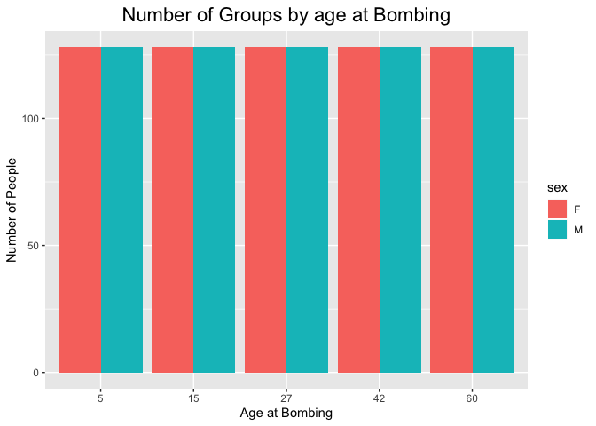
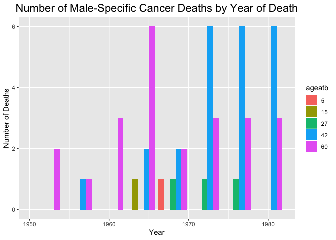

```r
library(tidyverse)
library(dplyr)
library(ggplot2)
```


## Opening file with Fortran format and cleaning up column names

```r
fstr <- c("2I3","I4","F7.1","I5","I4","F10.2","26I4")
hiroshima_nagasaki <- read.fortran("r10cancrfix.dat",fstr)

names(hiroshima_nagasaki) <-  c("city", "sex", "ageatb", "dose_centigray", "time", "index", "total_year", "alldeaths", "alldis", "allneo", "allmal", "leuk", "nonleuk", "digest", "esoph", "stomach", "colon", "rectum", "liver", "gallbldr", "pancreas", "othrdig", "resp", "lung", "fbreast", "fgenital", "cervix", "ovary", "prostate", "urinary", "lymphoma", "myeloma", "othrca")

hiroshima_nagasaki <- hiroshima_nagasaki %>% 
  mutate_at(vars(city), ~str_replace_all(., "0", "Hiroshima")) %>% 
  mutate_at(vars(city), ~str_replace_all(., "1", "Nagasaki")) %>% 
  mutate_at(vars(sex), ~str_replace_all(., "0", "M")) %>% 
  mutate_at(vars(sex), ~str_replace_all(., "1", "F")) %>%
  mutate_at(vars(time), ~paste0("19", .)) %>% 
  rowid_to_column(var='observation') %>% 
  mutate_at(vars(dose_centigray), as.factor) %>% 
  mutate_at(vars(ageatb), as.factor) 
```

## How many NA's?

```r
naniar::miss_var_summary(hiroshima_nagasaki)
```

```
## # A tibble: 34 x 3
##    variable       n_miss pct_miss
##    <chr>           <int>    <dbl>
##  1 observation         0        0
##  2 city                0        0
##  3 sex                 0        0
##  4 ageatb              0        0
##  5 dose_centigray      0        0
##  6 time                0        0
##  7 index               0        0
##  8 total_year          0        0
##  9 alldeaths           0        0
## 10 alldis              0        0
## # … with 24 more rows
```

## Tidying Data

```r
tidy_hiroshima_nagasaki <- hiroshima_nagasaki %>% 
  pivot_longer(-c(observation, city, sex, ageatb, dose_centigray, time, index, total_year, alldeaths),
               names_to = "type_death",
               values_to = "number_death")

tidy_hiroshima_nagasaki
```

```
## # A tibble: 32,000 x 11
##    observation city  sex   ageatb dose_centigray time  index total_year
##          <int> <chr> <chr> <fct>  <fct>          <chr> <int>      <dbl>
##  1           1 Hiro… M     5      0              1952      1       110.
##  2           1 Hiro… M     5      0              1952      1       110.
##  3           1 Hiro… M     5      0              1952      1       110.
##  4           1 Hiro… M     5      0              1952      1       110.
##  5           1 Hiro… M     5      0              1952      1       110.
##  6           1 Hiro… M     5      0              1952      1       110.
##  7           1 Hiro… M     5      0              1952      1       110.
##  8           1 Hiro… M     5      0              1952      1       110.
##  9           1 Hiro… M     5      0              1952      1       110.
## 10           1 Hiro… M     5      0              1952      1       110.
## # … with 31,990 more rows, and 3 more variables: alldeaths <int>,
## #   type_death <chr>, number_death <int>
```

## Graphs

```r
hiroshima_nagasaki %>% 
  group_by(sex, ageatb) %>% 
  ggplot(aes(x = ageatb, fill = sex)) + 
  geom_bar(position = "dodge") +
  labs(title = "Number of Groups by age at Bombing",
       x = "Age at Bombing",
       y = "Number of People")+ 
  theme(plot.title = element_text(size = rel(1.5), hjust = 0.5))
```

<!-- -->


```r
hiroshima_nagasaki %>% 
  group_by(sex, time) %>% 
  ggplot(aes(x = time, fill = sex)) + 
  geom_bar(position = "dodge") +
  labs(title = "Number of Groups by Year of Death",
       x = "Year of Death",
       y = "Number of People")+ 
  theme(plot.title = element_text(size = rel(1.5), hjust = 0.5))
```

<!-- -->


```r
tidy_hiroshima_nagasaki %>% 
  filter(type_death != "alldis" & type_death != "allneo" & type_death != "allmal" & type_death != "nonleuk" & type_death != "digest") %>% 
  group_by(type_death) %>% 
  ggplot(aes(x = type_death, y = number_death, fill = sex)) + 
  geom_bar(stat = "identity") +
  labs(title = "Number of Cancer Deaths by Type",
       x = "Cancer Type",
       y = "Number of Deaths")+ 
  theme(plot.title = element_text(size = rel(1.5), hjust = 0.5))+
  coord_flip()
```

<!-- -->

This graph summarizes the number of deaths for each cancer type. Most notably, and stomach cancers were the most prevalent. 

https://www.ncbi.nlm.nih.gov/pmc/articles/PMC1860129/

Japanese people more susceptible to gastritis (inflammation of protective lining of the stomach), and therefore more susceptible to stomach cancers. 


```r
hiroshima_nagasaki %>% 
  group_by(dose_centigray, sex) %>% 
  summarise(sum = sum(alldeaths)) %>% 
  ggplot(aes(x = dose_centigray, y = sum, fill = sex)) + 
  geom_bar(stat = "identity") +
  labs(title = "Number of Cancer Deaths by Dose",
       x = "Dose in Centigray",
       y = "Number of Deaths")+ 
  theme(plot.title = element_text(size = rel(1.5), hjust = 0.5))
```

<!-- -->
Many more people died of cancer at extremely low doses (most people had an exposure of less than .1 centigray). This is most likely because people who had much higher doses had died of the atomic bomb.  


```r
hiroshima_nagasaki %>% 
  group_by(sex, ageatb) %>% 
  summarise(sum = sum(alldeaths)) %>% 
  ggplot(aes(x = ageatb, y = sum, fill = sex)) + 
  geom_bar(stat = "identity", position = "dodge") +
  labs(title = "Number of Cancer Deaths by Age at Exposure",
       x = "Age at Exposure",
       y = "Number of Deaths")+ 
  theme(plot.title = element_text(size = rel(1.5), hjust = 0.5))
```

<!-- -->
There were more deaths in people who were older at the time of the bombing. 


```r
tidy_hiroshima_nagasaki%>% 
  mutate_at(vars(time), as.integer) %>% 
  group_by(time) %>% 
  summarise(sum = sum(number_death)) %>% 
  ggplot(aes(x = time, y = sum)) + 
  geom_line(color = "steelblue") +
  labs(title = "Number of Cancer Deaths by Year of Death",
       x = "Year",
       y = "Number of Deaths")+ 
  theme(plot.title = element_text(size = rel(1.5), hjust = 0.5))
```

<!-- -->
There is a positive trend in the people who died over the years. After 1976, there was a drop in the number of deaths. 


```r
hiroshima_nagasaki %>% 
  group_by(sex, city) %>% 
  summarise(sum = sum(alldeaths)) %>% 
  ggplot(aes(x = sex, y = sum, fill = city)) + 
  geom_bar(stat = "identity") +
  labs(title = "Number of Cancer Deaths by Sex",
       x = "Sex",
       y = "Number of Deaths")+ 
  theme(plot.title = element_text(size = rel(1.5), hjust = 0.5))
```

<!-- -->
Females had more cancer deaths than males in total, and we are unsure of the reasons why. 


```r
hiroshima_nagasaki%>% 
  mutate_at(vars(time), as.integer) %>% 
  group_by(time, sex) %>% 
  summarise(sum = sum(alldeaths)) %>% 
  ggplot(aes(x = time, y = sum, col = sex)) + 
  geom_line() +
  labs(title = "Number of Cancer Deaths by Year of Death",
       x = "Year",
       y = "Number of Deaths")+ 
  theme(plot.title = element_text(size = rel(1.5), hjust = 0.5))
```

<!-- -->
For some reason, the number of females who died from cancer increased over the whole time interval, but the males who died from cancer stayed somewhat constant. 


```r
tidy_hiroshima_nagasaki %>% 
  mutate_at(vars(time), as.integer) %>% 
  filter(type_death == "fgenital"| type_death == "cervix"| type_death == "uterus") %>% 
  group_by(time, ageatb) %>% 
  summarise(sum = sum(number_death)) %>% 
  ggplot(aes(x = time, y = sum, fill = ageatb)) + 
  geom_bar(stat = "identity", position = "dodge") +
  labs(title = "Number of Female-Specific Cancer Deaths by Year of Death",
       x = "Year",
       y = "Number of Deaths")+ 
  theme(plot.title = element_text(size = rel(1.5), hjust = 0.5))
```

<!-- -->
There is a downward trend in the number of deaths among 60 year olds and an upward trend among 27 year olds and 15 year olds at the time of the bombing. 


```r
tidy_hiroshima_nagasaki %>% 
  mutate_at(vars(time), as.integer) %>% 
  filter(type_death == "fgenital"| type_death == "cervix"| type_death == "ovary" | type_death == "fbreast") %>% 
  group_by(time) %>% 
  summarise(sum1 = sum(number_death)) %>% 
  ggplot(aes(x = time, y = sum1)) + 
  geom_line(color = "red") +
  labs(title = "Number of Female-Specific Cancer Deaths by Year of Death",
       x = "Year",
       y = "Number of Deaths")+ 
  theme(plot.title = element_text(size = rel(1.5), hjust = 0.5))
```

<!-- -->

Between 1960 and 1970, there was a dip in female-specific cancer deaths (although we are not sure of why)


```r
tidy_hiroshima_nagasaki %>% 
  mutate_at(vars(time), as.integer) %>% 
   filter(type_death == "prostate") %>%  
  group_by(time, ageatb) %>% 
  summarise(sum = sum(number_death)) %>% 
  ggplot(aes(x = time, y = sum, fill = ageatb)) + 
  geom_bar(stat = "identity", position = "dodge") +
  labs(title = "Number of Male-Specific Cancer Deaths by Year of Death",
       x = "Year",
       y = "Number of Deaths")+ 
  theme(plot.title = element_text(size = rel(1.5), hjust = 0.5))
```

<!-- -->


```r
tidy_hiroshima_nagasaki %>% 
  mutate_at(vars(time), as.integer) %>% 
  filter(type_death == "prostate") %>% 
  group_by(time) %>% 
  summarise(sum1 = sum(number_death)) %>% 
  ggplot(aes(x = time, y = sum1)) + 
  geom_line(color = "blue") +
  labs(title = "Number of Male-Specific Cancer Deaths by Year of Death",
       x = "Year",
       y = "Number of Deaths")+ 
  theme(plot.title = element_text(size = rel(1.5), hjust = 0.5))
```

<!-- -->
There was a dip in male-specific cancer deaths in 1968, but this is probably not statistically significant (it's a difference in two deaths)


```r
hiroshima_nagasaki %>% 
  group_by(sex, city) %>% 
  summarise(sum = sum(alldeaths)) %>% 
  ggplot(aes(x=city, y = sum, fill = sex))+
  geom_bar(stat="identity")+
  labs(title = "Death by City", x= "City", y= "Deaths")+
  theme(plot.title = element_text(size = rel(1.5), hjust = 0.5))
```

<!-- -->
There were many more deaths in hiroshima than nagasaki, and this is because the population of Hiroshima was much bigger. Hiroshima = 350,000, Nagasaki = 263,000
